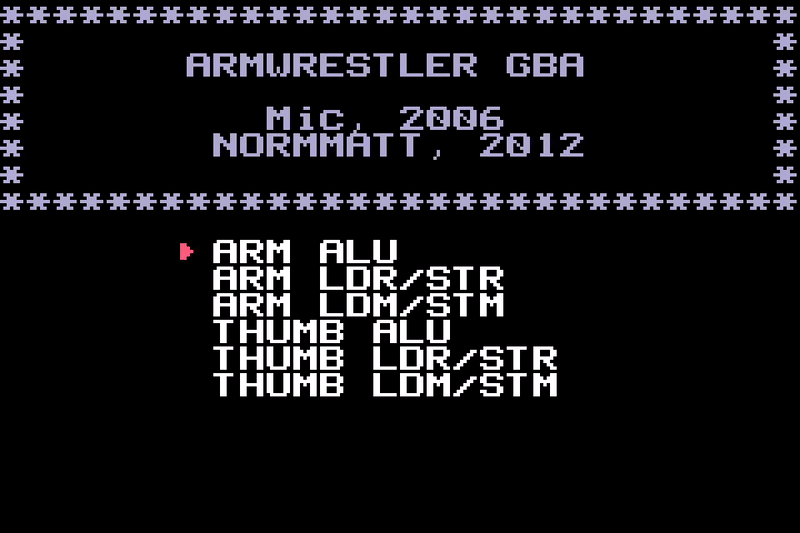
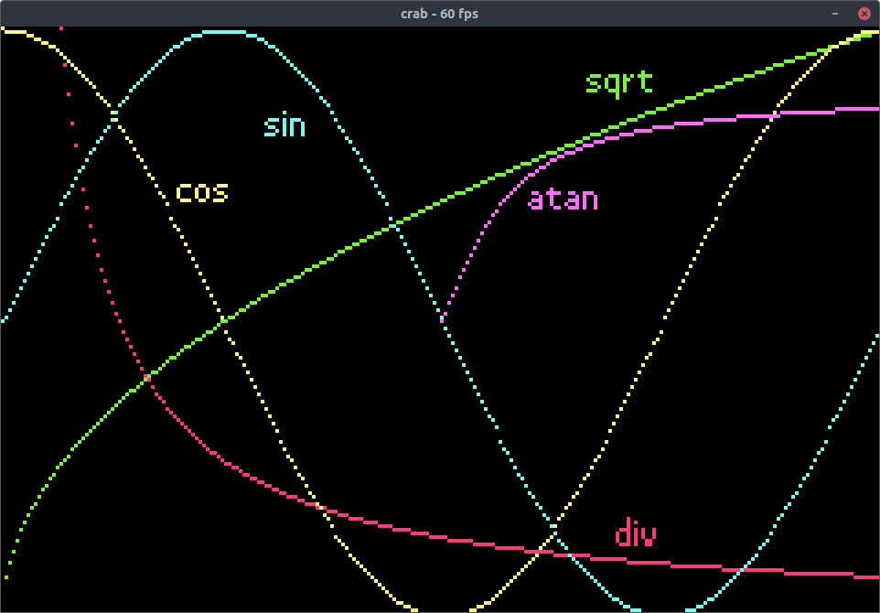
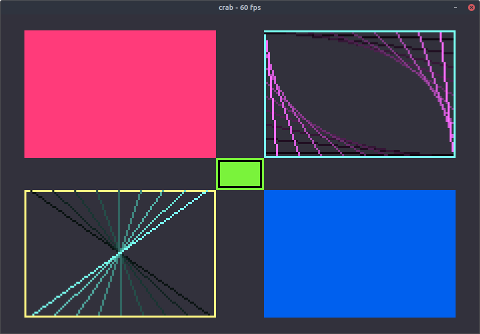

# crab

A very rough start to a Game Boy Advance emulator in Crystal Lang. The long-term goal is simply playability of popular titles. The name of the project come from the emudev discord, where "crab" was suggested for "Crystal Advanced Boy." Close enough.

## Installation

At the moment, a `shards install` is all that's required.

## Usage

This is not in a functional state. As instructions are being implemented, you can print the trace by compiling with `-Dtrace` or print logs by compiling with `-Dlog`. Next, simply provide the executable with the path to your rom.

## Features and Remaining Work

### Features

- GLSL shaders for color reproduction
- Basic PPU mode 0, 3, 4, and 5 implementations
- Passing [armwrestler](https://github.com/destoer/armwrestler-gba-fixed)
- Passing [FuzzARM](https://github.com/DenSinH/FuzzARM)
- Passing roughly half of [gba-suite](https://github.com/jsmolka/gba-suite)

### Remaining Work

Really, this list should include _everything_...

- Interrupts
- Timers
- Sound
- PPU things
  - Affine
  - Mosaic
  - Window
  - Objects
  - Alpha blending
  - Etc
- Etc

## Contributing

1. Fork it (<https://github.com/mattrberry/crab/fork>)
2. Create your feature branch (`git checkout -b my-new-feature`)
3. Commit your changes (`git commit -am 'Add some feature'`)
4. Push to the branch (`git push origin my-new-feature`)
5. Create a new Pull Request

## Contributors

- [Matthew Berry](https://github.com/mattrberry) - creator and maintainer
